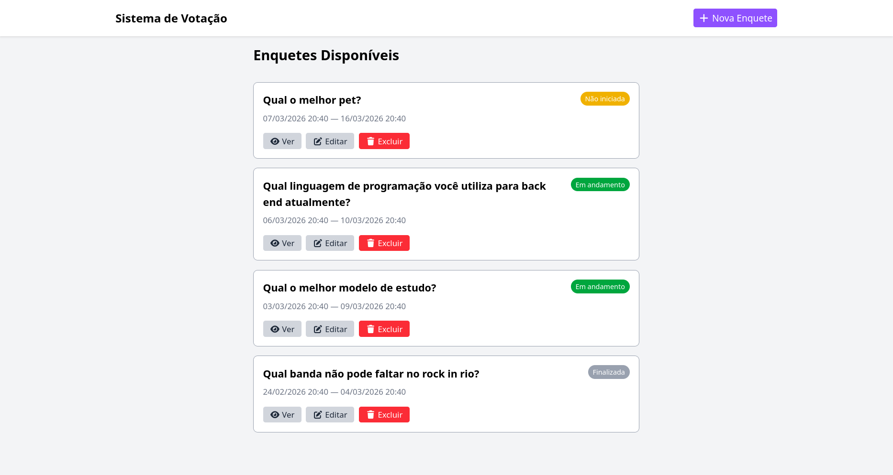
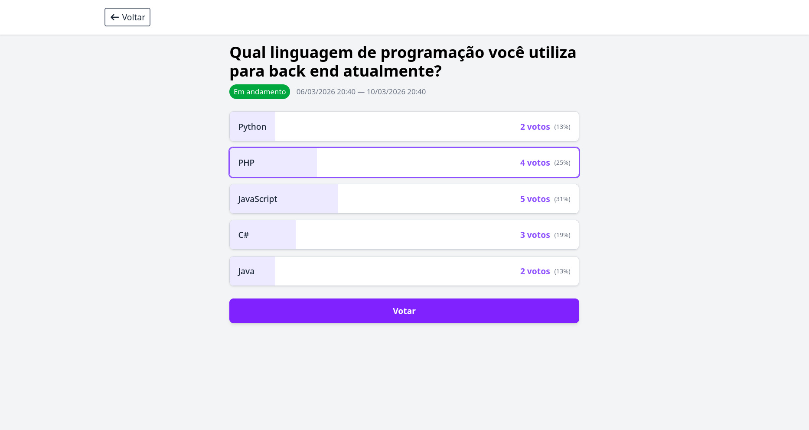
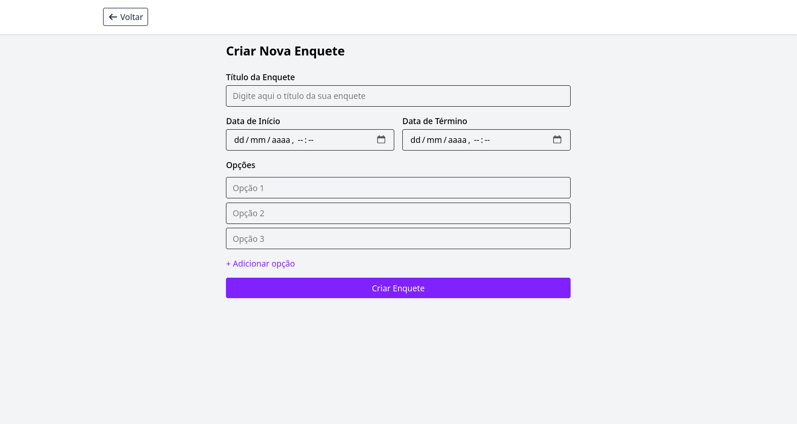

# Sistema de Votação

Aplicação web para criação e gerenciamento de enquetes.

O projeto foi desenvolvido com **Laravel** e executado em ambiente
**Docker**, como parte de um teste técnico para estágio.

------------------------------------------------------------------------

## Telas da aplicação

### Tela inicial



### Visualização da enquete



### Formulário para nova enquete



------------------------------------------------------------------------

## Tecnologias utilizadas

### Backend

-   PHP
-   Laravel
-   Eloquent ORM

### Banco de dados

-   MySQL

### Infraestrutura

-   Docker
-   Docker Compose
-   Nginx

------------------------------------------------------------------------

## Funcionalidades

-   Criar enquetes
-   Editar enquetes
-   Definir data de início e término
-   Votar em enquetes ativas
-   Visualizar resultados em tempo real
-   Visualizar resultados após o encerramento da votação

------------------------------------------------------------------------

## Como rodar o projeto

### 1. Clonar o repositório

``` bash
git clone https://github.com/jorgemendes07/sistema-de-votacao.git
cd sistema-de-votacao
cp .env.example .env
```

------------------------------------------------------------------------

### 2. Subir os containers Docker

``` bash
docker compose up -d
```

------------------------------------------------------------------------

### 3. Entrar no container da aplicação

``` bash
docker compose exec app bash
```

------------------------------------------------------------------------

### 4. Instalar as dependências

Dentro do container, execute:

``` bash
composer install
```

------------------------------------------------------------------------

### 5. Configurar o ambiente

``` bash
php artisan key:generate
```

------------------------------------------------------------------------

### 6. Compilar os assets (na raiz do projeto. fora do bash do docker)

``` bash
npm install
npm run build
```

------------------------------------------------------------------------

### 7. Rodar as migrations e popular o banco com dados de teste

``` bash
php artisan migrate --seed
```

------------------------------------------------------------------------

### 8. Acessar a aplicação

Abra no navegador:

    http://localhost:8000

------------------------------------------------------------------------